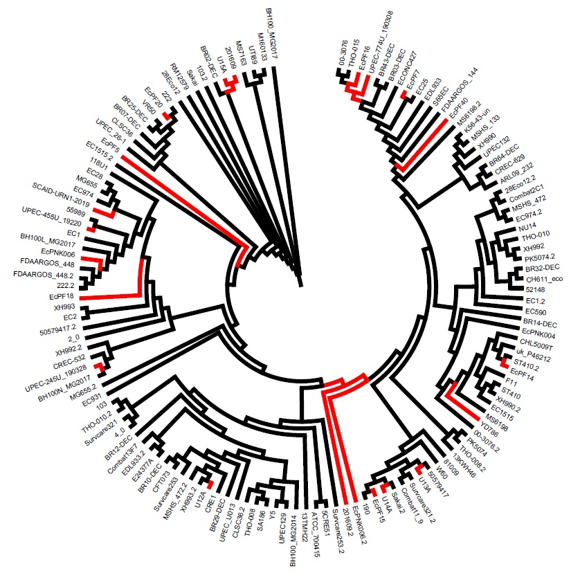

## Polymorphisms identification in the FimH adhesine of Uropathogenic *Escherichia coli*: Colonization and virulence effect in HTB-5 human bladder cells.

### Resume.

### Introduction.

| The adherence is the interaction of a microorganism to a biotic or abiotic surface, this interaction is mediated by proteic structures named fimbriae. These can contain one or more specialized subunits named adhesins (McLay *et al*., 2018). For the enterobacteria such Escherichia coli, the type 1 fimbria is expressed a long and thin appendix that contains at its apical end the adhesin FimH (Tseng *et. al.*, 2020). The commensal strains are restricted to the interaction with tri-mannosylated residues such as those present in the cells of the intestine, but in *E. coli* (UPEC), binding to mono-mannosylated residues, abundant in the bladder, is increased, generating a specialized tropism (Sokurenko *et. al.*, 1998). This has its origin in the FimH alleles defined by mutations of a single nucleotide, which cause structural changes and that they have an important effect if they are within the mannose binding domain (Paul *et. al.,* 2013). They are associated with colonization, persistence and severity of the infection.
| 

### Justification.

| The identification of natural alleles in Mexican clinical strains has not been reported so far, the prevalence of an allele and its identification could be helpful in optimizing a FimH-based vaccine against UPEC.

### Goal.

| The objective of this project its do an analysis of the sequences of FimH gene, and use statistical analysis .

### Preparation of the database.

Performed a search of the NCBI database, retrieved all complete genome sequences of E. coli associated with the urinary tract.

```{r}
#Set working directory
setwd("./")
```

```{r}
library(readr)
#Load the data base of the strains to work.
database <- read.delim("./results/traits/database.txt", row.names=1, comment.char="#")
head(database)
```

This archive contain a description of the genomes used. O and H are the respective antigen, this information was obtain to [SerotypeFinder](https://cge.cbs.dtu.dk/services/SerotypeFinder/). Serotype it is the union of that information. While **M**ulti **L**ocus **S**equence **T**ype ([MLST](https://pubmlst.org/organisms/escherichia-spp)) .

This script its a sequence report of the analysis of FimH sequences.

```{r Figure1, echo=TRUE, message=TRUE, warning=TRUE, paged.print=TRUE}
#Load the next libraries.
library(dplyr)
library(ggplot2)
#Create a graphic
Genomes_Year_Country <- ggplot (data = database, mapping = aes(x = Country, y= Year)) + geom_count(color="Blue") + labs(title = "Origin and year of colection of UPEC strains", caption = "Figure 1.") + theme_classic() + theme(axis.text.x = element_text(size=8, angle=90))
Genomes_Year_Country
```

The image showed clearly that we have analysis sequence in the period of 2010 to 2020, the distribution also showed a dominance of USA data, with Brazil and China whom had little explosions of genomes sequences. Mexico in particular are a little under represent, and we proudly said that all the genomes in this chart from Mexico are be from our laboratory.

However, we can also analyse the data using a four variable graphic. In this case, we only select the two groups that we are more interested. The Urinary tract Infections (UTI) versus the Recurrent ITU.

```{r}
#Use the filter option to make a new table with only RUTI 
RUTI<- database %>% filter(Disease=="RUTI")
UTI<- database %>% filter(Disease=="UTI")
nrow(RUTI)
nrow(UTI)
RUTI_vs_UTI<-rbind(RUTI,UTI)
nrow(RUTI_vs_UTI)
```

With this new data we can make a graphic that allow four variables to compare the UTI vs RUTI strains.

```{r eval=FALSE, include=FALSE}
Four_variables_graph <- ggplot (data = RUTI_vs_UTI, mapping = aes(y=Phylogroup, x=Disease, color= Year)) + geom_count() + labs(title = "UTI versus RUTI", caption = "Figure 2.") + facet_wrap("MLST")+ theme_bw() + theme(axis.text.x = element_text(size=8, angle=90), axis.text.y = element_text((size=6)))
Four_variables_graph
```


With that information we clearly see that are MLST exclusive for RUTI and for UTI. In 4, 43, 471, and 494, are for UTI strains, while 1, 1193, 129, 199, 24, 295, 736, and 77 are ST exclusive for RUTI. A brief search in PubMed, associated 1193 ST with a multidrug resistant bacteria.

Focused in the new information the complete genome and the accessory sequences was downloading from NCBI. For make the work to find the FimH sequence more easy, the next script were used.

```{r GeneSearch.sh, eval=FALSE, include=FALSE}
#This little script it is useful for search and recover the FimH sequence in a database of FASTA CDS sequences, little modificatiuon will be allow to search any gen.
#This script must be located in the directory with the files of the sequence in a .txt format.

#Create a folder called "output"
mkdir ./output

#Create a tect file called "results"

touch ./output/FimH-bp.txt

#For a variable "i" in the name of the text file inside of the directory

for i in *.txt;

#Print the name of the file, grep find "FimH" and print 12 lines. 

do echo ">"$i >> ./output/resultados.txt
grep FimH -A13 -h $i | tail -n +2  >> ./output/resultados.txt

done

echo "done"
```

This was used in the directory "genomes", once run the script identify the 53% of the sequence, sadly the successes of this script are relate to the appropriately annotation of the sequences. That is a problem in our case, because at least the 50% of the data are no identify. However, manually finished the database of all the FimH genome, the text file was called FimH_pb.txt

```{r}
fimH_database <- read.delim("./data/FimH_pb.txt", header = FALSE)
head (fimH_database)
```

This data base was analyse using the Mesquite program, in this scenario a alignment with Clustal W and tree was performed. The data showed that the RUTI strains are located around of the UTI. Cleary that the FimH allele are not related with the RUTI phenotype.



However, with the Beauti and Beast programs, we develop a Bayesian analysis, to obtain a likelihood probability, based in RUTI trait.

```{r}
#Import data set of Beast. *.log data contain, likelihood, frecuency, position.
FimH_pb.log <- read.delim("~/GitHub/FimH_Variations/data/FimH_pb.log.txt", comment.char="#")
#With a frecuency graphic we can considerate if there are a posible selection.
frecuency<-ggplot(FimH_pb.log, aes(x=frequencies1)) + geom_histogram(bins = 50, color = "black", fill = "blue") + theme_minimal() +labs(title = "Histogram of the frecuency of Likelihood", caption = "Figure 3.")
frecuency
```

In the graphic of frequency, we can see that the data are centered, indicative that maybe we don't have a selective presion. Also, the calculate likelihood it is not significative, because the results are minor to zero.

```{r}
neutral<-subset(FimH_pb.log,FimH_pb.log$likelihood > 0)
problem<-subset(FimH_pb.log,FimH_pb.log$treeLikelihood >0)
neutral
problem
```

### Conclusions

There are not signs of adtaptative evolution in fimH gene from a Bayesian analysis of RUTI versus ITU.

### Bibliografía:

McLay, R. B., *et al.*, (2018). 34(3), 1133-1142.

Tseng, C. C., *et al.*, (2020).

Sokurenko, E. *et al.*, (1998). 95(15), 8922-8926.

Paul, S., *et al.*, (2013). 195(2), 231-242.

Joensen, K. G., *et al.*, (2015). *53*(8), 2410-2426.

            \       Find your way       /
             \            and          /   
              \    change the world  [|:  
               \    until your last /[|:  [|:
         |:]    \      breath      / [|:  [|:
         |:]   |]\                /  [|:  [|:   :|]
         |:]   |] \   <     >   [  [ [|:  [|:   :|]
        [|:]  :|]  ]   < M >   [  [  [|: [|:   :|]
        [|:   :|]  ]\   < >   /[  [    [ |:   :|]  
        [|:   :|]  ] \   v   /  [. [|:  [|:   |:|]
        [|:   :|] |]  ]      [   [. [|:  [|: :|:|]
        [|:   :|] |]  ]  (#) [   [. [|:  [|: :|]
        [|:|:|:|] |]  / .nHn.\   [. [|:  [|: :|]
            |:|]  |] / HHHHH.\  [. [|:  [|:|:|]
            |:|]  |]/  `HH("N  \ [. [|:  [|:
            |:|]  |]    HHH  "  \[_ [|:  [|:
            :|]  /      NNN      \  [|:  [|:  
            :|] /       N/"       \ [|:  [|:  
            :|]/        N H        \[|:  [|:
            :|]         N           \|:  [|:
             /          q,           \   [|:
            /                         \  [|:
